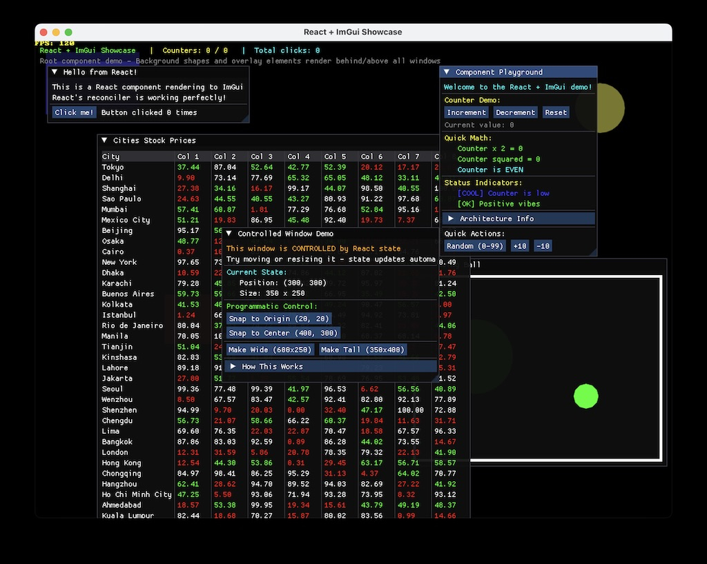

# imgui-react-runtime

A React runtime for [Dear ImGui](https://github.com/ocornut/imgui) powered by [Static Hermes](https://github.com/facebook/hermes). Write your ImGui interfaces using React's declarative component model and JSX, with full support for hooks, state management, and event handling.

## Why This Project?

This project demonstrates how Static Hermes seamlessly bridges JavaScript and C++ ecosystems—combining React's modern development experience with the performance and directness of [Dear ImGui](https://github.com/ocornut/imgui) and [Sokol](https://github.com/floooh/sokol).

**Key highlights:**

- **Fully native in Release mode** - Zero runtime dependencies, instant startup, single 5.2MB executable
- **JavaScript-first implementation** - ~2,400 lines of hand-written JS, only ~700 lines of C++ glue code
- **Native Dear ImGui components** - Not web-style HTML/CSS or React Native primitives, but direct ImGui widgets
- **Zero-cost FFI** - ~12,000 lines of auto-generated typed JavaScript bindings for Dear ImGui's C API

While this is an experimental project (not production-ready), it's a fully functional runtime you can build upon. Whether you're interested in learning about React reconcilers, exploring Static Hermes capabilities, or just building quick ImGui tools with React, this project has you covered.

**Contributions welcome!** If you find bugs, have suggestions, or want to add features, please open an issue or pull request. This project was built by a C/C++ systems developer (the architect of Hermes) with extensive assistance from Claude Code for the JavaScript and React implementation—so there's definitely room for improvement from experienced React developers!

---

_**Note**: This project is an independent experiment and is not affiliated with, endorsed by, or officially associated with React, Dear ImGui, or their respective teams._



## Table of Contents

- [Features](#features)
- [What is Static Hermes?](#what-is-static-hermes)
- [Platform Support & Requirements](#platform-support--requirements)
  - [Supported Platforms](#supported-platforms)
  - [Build Requirements](#build-requirements)
  - [Quick Start](#quick-start)
- [Examples](#examples)
  - [Hello World](#hello-world)
  - [Showcase](#showcase)
  - [Dynamic Windows](#dynamic-windows)
- [Creating Your Own App](#creating-your-own-app)
- [Supported Components](#supported-components)
  - [Container Components](#container-components)
  - [Text & Display](#text--display)
  - [Interactive Components](#interactive-components)
  - [Layout Components](#layout-components)
  - [Table Components](#table-components)
  - [Drawing Primitives](#drawing-primitives)
  - [Adding New Components](#adding-new-components)
- [Architecture](#architecture)
  - [Three-Unit Architecture](#three-unit-architecture)
  - [Component Overview](#component-overview)
  - [Rendering Pipeline](#rendering-pipeline)
- [Build System](#build-system)
  - [CMake Structure](#cmake-structure)
  - [Compilation Modes](#compilation-modes)
  - [Building the Project](#building-the-project)
- [License](#license)

## Features

- ✅ **Fully native compilation** - Release builds are standalone executables with zero dependencies and instant startup
  - Showcase example: 5.2MB total (3MB Hermes VM, 1.8MB React native code, rest is app/renderer/ImGui)
  - No JavaScript files, no bytecode, no interpreter at runtime
  - Lightning-fast startup - no parsing, no JIT warmup, just native code execution
  - Single executable distribution
- ✅ **React 19.2.0** with custom reconciler
- ✅ **React Compiler support** - Optional automatic memoization optimization
- ✅ **Static Hermes** with zero-overhead FFI to Dear ImGui
- ✅ **Event loop** with `setTimeout`, `setImmediate`, and Promise support
- ✅ **React hooks** (`useState`, `useEffect`, etc.)
- ✅ **Multiple windows** with independent state
- ✅ **Controlled/uncontrolled** window positioning and sizing
- ✅ **Custom drawing** with shapes (rectangles, circles)
- ✅ **Tables** with live-updating data
- ✅ **Fullscreen root canvas** for background elements and overlays
- ✅ **Three-unit architecture** separating event loop, React logic, and ImGui rendering

## What is Static Hermes?

[Hermes](https://github.com/facebook/hermes) is a compact (~3MB) JavaScript engine designed for mobile and embedded environments. Unlike traditional JavaScript engines that rely heavily on JIT compilation, Hermes focuses on ahead-of-time (AOT) compilation to bytecode, enabling extremely fast startup times and low memory footprint—ideal for resource-constrained devices.

*Static Hermes* extends Hermes with two powerful capabilities:

1. **Optional sound typing** - Add type annotations to JavaScript for static type checking
2. **Native code compilation** - Compile both typed and untyped JavaScript to native machine code

**Three compilation modes:**

- **Typed mode** → Compiles type-annotated JavaScript to native code with zero-overhead FFI to C/C++
- **Untyped mode** → Compiles standard JavaScript to Hermes bytecode (or native code)
- **Source mode** → Runs JavaScript directly from source (parsing + JIT)

**Zero-cost FFI**: In typed mode, JavaScript functions can call C functions with **no overhead**—no marshaling, no type conversion, no copying. Calls compile down to direct native function calls, making it perfect for integrating JavaScript with C/C++ libraries like Dear ImGui and Sokol.

This project uses typed mode for the ImGui FFI layer (`lib/imgui-unit/`) and untyped mode for the React runtime and application code. All units communicate seamlessly via `globalThis`, demonstrating Static Hermes's ability to mix typed and untyped code in a single application.

## Platform Support & Requirements

### Supported Platforms

- **macOS** ✅ Fully tested and supported
- **Linux** ✅ Tested on Ubuntu 24.04.3 LTS
- **Windows** ⏳ Coming soon (waiting for Static Hermes Windows support)

### Build Requirements

You'll need:

- **Node.js and npm** (Node 20 or later recommended) - For esbuild bundler and React dependencies
  - macOS: `brew install node` or download from [nodejs.org](https://nodejs.org/)
  - Linux: `snap install node --classic` (recommended) or `apt-get install nodejs npm`
- **C++ Compiler**
  - **Clang** (recommended) - Officially supported by Static Hermes
  - GCC also works but Clang is the tested configuration
  - macOS: Install [Xcode Command Line Tools](https://developer.apple.com/xcode/) or full Xcode
  - Linux: `apt-get install clang` or `yum install clang`
- **CMake** (3.20 or later)
  - macOS: `brew install cmake`
  - Linux: `apt-get install cmake` or `yum install cmake`
- **Ninja** - Fast build system
  - macOS: `brew install ninja`
  - Linux: `apt-get install ninja-build` or `yum install ninja-build`
- **Graphics libraries** - Required for Sokol (window management and OpenGL rendering)
  - macOS: (no additional packages needed)
  - Linux: `apt-get install libx11-dev libxi-dev libxcursor-dev libgl1-mesa-dev libicu-dev`

**That's it!** The project has **no other dependencies**. The CMake build process automatically downloads and builds Static Hermes on first configure.

### Quick Start

```bash
# Clone the repository
git clone https://github.com/yourusername/imgui-react-runtime.git
cd imgui-react-runtime

# Install JavaScript dependencies (React, esbuild, etc.)
npm install

# Configure (downloads and builds Hermes automatically on first run)
# On Linux, explicitly specify Clang as the compiler:
cmake -B cmake-build-debug -DCMAKE_BUILD_TYPE=Debug -G Ninja \
  -DCMAKE_C_COMPILER=clang -DCMAKE_CXX_COMPILER=clang++

# On macOS, Clang is the default, so just:
# cmake -B cmake-build-debug -DCMAKE_BUILD_TYPE=Debug -G Ninja

# Build all examples
cmake --build cmake-build-debug

# Run it!
./cmake-build-debug/examples/showcase/showcase
```

You should see the showcase window with multiple demos, background decorations, and interactive controls!

## Examples

The project includes three example applications that demonstrate different features.

### Hello World

**Location**: `examples/hello/`

The simplest possible example—just "Hello World!" text rendered in a fullscreen root window. Perfect for verifying your setup works and understanding the minimal structure.

```jsx
// examples/hello/app.jsx
import React from 'react';

export function App() {
  return (
    <root>
      <text>Hello World!</text>
    </root>
  );
}
```

**Run it**:
```bash
cmake --build cmake-build-debug --target hello
./cmake-build-debug/examples/hello/hello
```

### Showcase

**Location**: `examples/showcase/`

A comprehensive demo showing off most features:

- **Multiple independent windows** with separate state
- **React hooks** (`useState`, `useEffect`)
- **Event handlers** (button clicks)
- **Live-updating table** with 40 rows × 8 columns of random stock prices
- **Physics simulation** (bouncing ball) with custom drawing primitives
- **Controlled vs uncontrolled** window positioning patterns
- **Background decorations** using the `<root>` component
- **Status bars and overlays** rendered in the root canvas

The showcase includes four components:

1. **StockTable.jsx** - Demonstrates table rendering with live data updates using `setInterval`
2. **BouncingBall.jsx** - Shows physics simulation with `<rect>` and `<circle>` primitives
3. **ControlledWindow.jsx** - Illustrates controlled window positioning with state updates
4. **Main App** - Status bar, background shapes, and two counter windows with buttons

**Run it**:
```bash
cmake --build cmake-build-debug --target showcase
./cmake-build-debug/examples/showcase/showcase
```

### Dynamic Windows

**Location**: `examples/dynamic-windows/`

Demonstrates dynamic creation and destruction of windows at runtime:

- **Adding windows** by clicking a button
- **Removing windows** via the close button (X)
- **React list rendering** with `key` prop for stable identity
- **Window lifecycle** management with state arrays

```jsx
const [windows, setWindows] = useState([
  { id: 1, title: "Window 1" },
  { id: 2, title: "Window 2" },
]);

const closeWindow = (windowId) => {
  setWindows(windows.filter(w => w.id !== windowId));
};

{windows.map(w => (
  <window
    key={w.id}
    title={w.title}
    onClose={() => closeWindow(w.id)}
  >
    <text>Click the X to close this window</text>
  </window>
))}
```

**Run it**:
```bash
cmake --build cmake-build-debug --target dynamic-windows
./cmake-build-debug/examples/dynamic-windows/dynamic-windows
```

## Creating Your Own App

Creating a new React + ImGui application is straightforward with the `add_react_imgui_app()` CMake function.

### 1. Create Your App Directory

```bash
mkdir examples/myapp
cd examples/myapp
```

### 2. Create React Components

**app.jsx**:
```jsx
import React, { useState } from 'react';

export function App() {
  const [count, setCount] = useState(0);

  return (
    <window title="My App">
      <text>Welcome to my ImGui + React app!</text>
      <separator />
      <button onClick={() => setCount(count + 1)}>
        Increment
      </button>
      <text>Count: {count}</text>
    </window>
  );
}
```

**index.js**:
```jsx
import React from 'react';
import { createRoot, render } from 'react-imgui-reconciler/reconciler.js';
import { App } from './app.jsx';

// Configure window (optional)
globalThis.sappConfig.title = "My App";
globalThis.sappConfig.width = 800;
globalThis.sappConfig.height = 600;

// Create React root
const root = createRoot();

// Expose to ImGui unit
globalThis.reactApp = {
  rootChildren: [],
  render() {
    render(React.createElement(App), root);
  }
};

// Initial render
globalThis.reactApp.render();
```

### 3. Create C++ Entry Point

**myapp.cpp**:
```cpp
#define PROVIDE_IMGUI_MAIN
#include "imgui-runtime.h"
```

That's it! The `PROVIDE_IMGUI_MAIN` macro tells the runtime to provide a default main function that automatically loads and runs your React bundle.

### 4. Add CMake Configuration

**CMakeLists.txt**:
```cmake
add_react_imgui_app(
  TARGET myapp
  ENTRY_POINT index.js
  SOURCES myapp.cpp
)
```

### 5. Register with Parent CMake

Add to `examples/CMakeLists.txt`:
```cmake
add_subdirectory(myapp)
```

### 6. Build and Run

```bash
cmake --build cmake-build-debug --target myapp
./cmake-build-debug/examples/myapp/myapp
```

That's it! The build system automatically:
- Collects all `*.jsx` and `*.js` files
- Bundles with esbuild (JSX transpilation, module resolution)
- Compiles based on `REACT_BUNDLE_MODE` (native/bytecode/source)
- Links with all required libraries

## Supported Components

These components map directly to **native Dear ImGui widgets**—not web-style HTML/CSS elements or React Native primitives. Each component calls Dear ImGui's C API through zero-cost FFI, giving you the full power and flexibility of ImGui.

**This is a demo project**, so only a representative subset of ImGui's widgets have been implemented. However, adding new components is straightforward—see [Adding New Components](#adding-new-components) below.

All components use **lowercase names** in JSX (e.g., `<window>`, `<button>`). React treats lowercase as host primitives, uppercase as component references.

### Container Components

#### `<root>`

Creates a fullscreen, transparent window covering the entire viewport. Perfect for background elements, overlays, and status bars that should appear behind or above all other windows.

**Props**: None

**Special Behaviors**:
- Always matches viewport size automatically
- Transparent background (no visible window)
- Cannot be moved or resized
- Never brought to front on focus
- **Only one `<root>` per app** (warning logged if multiple detected)

**Example**:
```jsx
<root>
  {/* Background decorations */}
  <rect x={0} y={0} width={1200} height={30} color="#00000080" />
  <text color="#00FF00">Status Bar</text>

  {/* Regular windows appear in front */}
  <window title="Main Window">
    <text>Content here</text>
  </window>
</root>
```

#### `<window>`

Creates a standard ImGui window that can be moved, resized, and closed.

**Props**:
- **Position (Controlled)**: `x`, `y` - Position enforced every frame
- **Position (Uncontrolled)**: `defaultX`, `defaultY` - Initial position only
- **Size (Controlled)**: `width`, `height` - Size enforced every frame
- **Size (Uncontrolled)**: `defaultWidth`, `defaultHeight` - Initial size only
- `title` - Window title (default: "Window")
- `flags` - ImGui window flags as integer (default: 0)
- `onWindowState` - Callback `(x, y, width, height)` when position/size changes
- `onClose` - Callback when close button (X) is clicked. **Presence of this prop enables the close button.**

**Special Behaviors**:
- Controlled props (`x`/`y`/`width`/`height`) are read back from ImGui each frame and fire `onWindowState` if changed
- Warns if both controlled and uncontrolled props are mixed
- Use controlled props for programmatic window management
- Use uncontrolled props for user-movable windows with initial placement

**Example**:
```jsx
// Uncontrolled window - user can move freely
<window title="Settings" defaultX={20} defaultY={20}>
  <text>Configuration options...</text>
</window>

// Controlled window - position managed by React state
<window
  title="Alert"
  x={centerX}
  y={centerY}
  onWindowState={(x, y, w, h) => console.log('Moved to', x, y)}
  onClose={() => setShowAlert(false)}
>
  <text>Alert message!</text>
</window>
```

#### `<child>`

Creates a scrollable sub-region within a window.

**Props**:
- `width`, `height` - Dimensions (0 = auto-size)
- `noPadding` - Remove padding (boolean)
- `noScrollbar` - Disable scrollbar and scroll with mouse (boolean)

**Example**:
```jsx
<window title="Scrollable Content">
  <child width={300} height={200}>
    {/* Lots of content that will scroll */}
    {items.map(item => <text key={item.id}>{item.name}</text>)}
  </child>
</window>
```

### Text & Display

#### `<text>`

Renders text with optional styling.

**Props**:
- `color` - Text color as hex string (`"#RRGGBB"` or `"#RRGGBBAA"`) or object `{r, g, b, a}` (values 0-255)
- `disabled` - Render as disabled/grayed out (boolean)
- `wrapped` - Enable text wrapping (boolean)

**Children**: Only accepts text children (concatenated into a single string)

**Example**:
```jsx
<text>Normal text</text>
<text color="#FF0000">Red text</text>
<text color="#00FF00AA">Semi-transparent green</text>
<text disabled>Disabled text</text>
<text wrapped>This is a very long text that will wrap to multiple lines...</text>
```

#### `<separator>`

Renders a horizontal separator line.

**Props**: None

**Example**:
```jsx
<text>Section 1</text>
<separator />
<text>Section 2</text>
```

### Interactive Components

#### `<button>`

Clickable button with an event handler.

**Props**:
- `onClick` - Callback function fired when button is clicked

**Children**: Only accepts text children (concatenated for button label)

**Example**:
```jsx
const [count, setCount] = useState(0);

<button onClick={() => setCount(count + 1)}>
  Increment
</button>
<text>Count: {count}</text>
```

### Layout Components

#### `<sameline>`

Places the next item on the same line as the previous item, rather than starting a new line.

**Props**: None

**Example**:
```jsx
<text>Name:</text>
<sameline />
<text>John Doe</text>
```

#### `<group>`

Groups elements together visually. Useful for spacing and organization.

**Props**: None

**Example**:
```jsx
<group>
  <text>Related items:</text>
  <text>Item 1</text>
  <text>Item 2</text>
</group>
```

#### `<indent>`

Indents all children by one level.

**Props**: None

**Example**:
```jsx
<text>Parent</text>
<indent>
  <text>Child 1</text>
  <text>Child 2</text>
</indent>
```

#### `<collapsingheader>`

Creates a collapsible section header. Children are only rendered when expanded.

**Props**:
- `title` - Header text (default: "Section")

**Example**:
```jsx
<collapsingheader title="Advanced Settings">
  <text>These settings are hidden by default</text>
  <button onClick={save}>Save</button>
</collapsingheader>
```

### Table Components

Tables in ImGui require a specific structure. Use `<table>` as the container, set up columns with `<tablecolumn>`, show headers with `<tableheader>`, and render data with `<tablerow>` and `<tablecell>`.

#### `<table>`

Creates a table container.

**Props**:
- `columns` - **Required.** Number of columns (must be > 0)
- `id` - Table ID string (default: "table")
- `flags` - ImGui table flags (default: resizable)

**Example structure**:
```jsx
<table columns={3}>
  <tablecolumn label="Name" />
  <tablecolumn label="Age" />
  <tablecolumn label="City" />
  <tableheader />

  <tablerow>
    <tablecell index={0}><text>Alice</text></tablecell>
    <tablecell index={1}><text>30</text></tablecell>
    <tablecell index={2}><text>NYC</text></tablecell>
  </tablerow>
</table>
```

#### `<tablecolumn>`

Configures a table column. Must be used before `<tableheader>`.

**Props**:
- `label` - Column header text (default: "")
- `flags` - ImGui column flags (default: none)
- `width` - Column width (default: 0 for auto)

#### `<tableheader>`

Renders the table header row using the column configurations.

**Props**: None

#### `<tablerow>`

Starts a new table row.

**Props**:
- `flags` - Row flags (default: 0)
- `minHeight` - Minimum row height (default: 0)

#### `<tablecell>`

Renders content in a specific column.

**Props**:
- `index` - Column index (0-based)

**Children**: Any components

**Full example**:
```jsx
const data = [
  { name: "Alice", age: 30, city: "NYC" },
  { name: "Bob", age: 25, city: "LA" },
];

<table columns={3}>
  <tablecolumn label="Name" />
  <tablecolumn label="Age" />
  <tablecolumn label="City" />
  <tableheader />

  {data.map((row, i) => (
    <tablerow key={i}>
      <tablecell index={0}><text>{row.name}</text></tablecell>
      <tablecell index={1}><text>{row.age}</text></tablecell>
      <tablecell index={2}><text>{row.city}</text></tablecell>
    </tablerow>
  ))}
</table>
```

### Drawing Primitives

These components use ImGui's DrawList API to render shapes directly. Coordinates are **relative to the window's content area** (not screen coordinates).

#### `<rect>`

Draws a rectangle.

**Props**:
- `x`, `y` - Position relative to window content area (default: 0)
- `width`, `height` - Dimensions (default: 100)
- `color` - Fill/stroke color as hex string or object (default: white)
- `filled` - Draw filled (true) or outline (false) (default: true)

**Example**:
```jsx
{/* Filled red rectangle */}
<rect x={10} y={10} width={100} height={50} color="#FF0000" filled={true} />

{/* Semi-transparent outline */}
<rect x={120} y={10} width={100} height={50} color="#0000FF80" filled={false} />
```

#### `<circle>`

Draws a circle.

**Props**:
- `x`, `y` - Center position relative to window content area (default: 50)
- `radius` - Circle radius (default: 10)
- `color` - Fill/stroke color (default: white)
- `filled` - Draw filled (true) or outline (false) (default: true)
- `segments` - Number of segments for smoothness (default: 12, higher = smoother)

**Example**:
```jsx
{/* Filled green circle */}
<circle x={50} y={50} radius={30} color="#00FF00" filled={true} segments={32} />

{/* Yellow outline */}
<circle x={150} y={50} radius={30} color="#FFFF00" filled={false} segments={24} />
```

**Drawing in `<root>` vs `<window>`**:

When using drawing primitives in a `<root>` component, coordinates are relative to the **screen/viewport**, making them perfect for background decorations:

```jsx
<root>
  {/* Background shape at absolute screen position */}
  <rect x={0} y={0} width={1200} height={30} color="#00000080" />
  <circle x={900} y={100} radius={40} color="#3030A0C0" />

  <window title="Main" defaultX={20} defaultY={40}>
    {/* Shape relative to this window's content area */}
    <rect x={10} y={10} width={50} height={50} color="#FF0000" />
  </window>
</root>
```

### Adding New Components

Adding new Dear ImGui components is straightforward. You only need to modify `lib/imgui-unit/renderer.js`:

**1. Add a render function for your component:**

```javascript
/**
 * Renders a checkbox component.
 */
function renderCheckbox(node: any): void {
  const props = node.props;
  const label = (props && props.label) ? props.label : "";
  const checked = (props && props.checked !== undefined) ? props.checked : false;

  // Allocate a boolean pointer for ImGui
  const pChecked = allocTmp(_sizeof_c_bool);
  _sh_ptr_write_c_bool(pChecked, 0, checked ? 1 : 0);

  // Call ImGui checkbox function
  if (_igCheckbox(tmpUtf8(label), pChecked)) {
    // Checkbox was clicked - read new value and invoke callback
    const newChecked = _sh_ptr_read_c_bool(pChecked, 0);
    if (props && props.onChange) {
      safeInvokeCallback(props.onChange, newChecked !== 0);
    }
  }
}
```

**2. Add a case to the switch statement in `renderNode()`:**

```javascript
// In renderNode() function, add to the switch statement:
case "checkbox":
  renderCheckbox(node);
  break;
```

**3. Use it in your React components:**

```jsx
const [enabled, setEnabled] = useState(false);

<checkbox
  label="Enable feature"
  checked={enabled}
  onChange={(newValue) => setEnabled(newValue)}
/>
```

**Tips for implementing components:**

- **Use allocTmp()** for temporary buffers (ImVec2, ImVec4, etc.) - they're automatically reused across renders
- **Check Dear ImGui documentation** at [imgui.h](https://github.com/ocornut/imgui/blob/master/imgui.h) for available functions and parameters
- **FFI bindings are in `js_externs.js`** - all ImGui functions are prefixed with `_ig` (e.g., `_igButton`, `_igText`)
- **Handle callbacks safely** with `safeInvokeCallback()` for exception handling
- **Validate numeric props** with `validateNumber()` to handle NaN/Infinity
- **Parse colors** with `parseColorToImVec4()` or `parseColorToABGR()` for consistent color handling

The FFI layer provides access to the entire Dear ImGui API, so you can expose any widget you need!

## Architecture

### Three-Unit Architecture

Static Hermes has two compilation modes that cannot be mixed in a single unit:

- **Untyped mode**: Standard JavaScript (React, reconciler, app code)
- **Typed mode**: Type-annotated code with zero-cost FFI (required for ImGui bindings)

To work around this limitation and provide a proper event loop, we use a **three-unit architecture**:

```
┌────────────────────────────────────────────────────────────────┐
│                      Application Process                        │
├────────────────────────────────────────────────────────────────┤
│                                                                 │
│  ┌──────────────┐   ┌─────────────────┐   ┌────────────────┐  │
│  │  Unit 1:     │   │    Unit 2:      │   │   Unit 3:      │  │
│  │  jslib       │   │    React        │   │   ImGui        │  │
│  │  (Untyped)   │   │   (Untyped)     │   │   (Typed)      │  │
│  │              │   │                 │   │                │  │
│  │ - Event loop │   │ - React 19.2.0  │   │ - FFI bindings │  │
│  │ - Timers     │   │ - Reconciler    │   │ - Renderer     │  │
│  │ - Console    │   │ - App code      │   │ - Sokol hooks  │  │
│  └──────────────┘   └─────────────────┘   └────────────────┘  │
│         │                    │                      │          │
│         └────────────────────┴──────────────────────┘          │
│                              │                                 │
│                   globalThis interface                         │
│                                                                 │
│  globalThis.setTimeout/setImmediate    (from jslib)            │
│  globalThis.reactApp.rootChildren      (from React)            │
│  globalThis.reactApp.render()          (from React)            │
│  globalThis.imguiUnit.renderTree()     (from ImGui)            │
│                                                                 │
├────────────────────────────────────────────────────────────────┤
│             Hermes Runtime (Static Hermes VM)                   │
│          Microtask queue enabled (Promise support)              │
├────────────────────────────────────────────────────────────────┤
│         C++ Runtime Layer (imgui-runtime library)               │
│    Sokol App Framework + Dear ImGui + Hermes Integration       │
└────────────────────────────────────────────────────────────────┘
```

**Load order**: jslib → React → ImGui

This ensures timer APIs are available for all subsequent code.

**Communication**: All units communicate through `globalThis`:

1. **jslib unit** exposes `setTimeout`, `setImmediate`, `console.log`, etc.
2. **React unit** builds component tree and exposes `globalThis.reactApp.rootChildren`
3. **ImGui unit** reads the tree from `globalThis.reactApp.rootChildren` and renders it

### Component Overview

#### **lib/jslib-unit/** - Event Loop & Runtime Polyfills

Provides a browser-like event loop with task scheduling:

- **Timer APIs**: `setTimeout`, `clearTimeout`, `setImmediate`, `clearImmediate`, `setInterval`, `clearInterval`
- **Task queue**: Sorted by deadline for efficient scheduling
- **Console**: `console.log`, `console.error`, `console.debug`
- **Environment**: `process.env.NODE_ENV`
- **C++ helpers**: `peekMacroTask()` and `runMacroTask()` for integration

**Compilation**: Untyped mode with `-Xes6-block-scoping`

#### **lib/react-imgui-reconciler/** - Custom React Reconciler

Implements React's reconciler interface to build an in-memory component tree:

- **TreeNode class**: Represents component instances with unique ID, type, props, children
- **TextNode class**: Represents text content
- **Host config**: Implements `createInstance`, `appendChild`, `commitUpdate`, etc.
- **Render API**: `createRoot()` and `render(element, root)`

The reconciler builds plain JavaScript objects in memory. It doesn't know anything about ImGui—that's the renderer's job.

**Compilation**: Untyped mode, bundled with esbuild alongside React

#### **lib/imgui-unit/** - ImGui FFI & Rendering

Provides zero-cost FFI bindings and the rendering pipeline:

- **js_externs.js**: 500KB+ of auto-generated FFI declarations for all ImGui functions
- **renderer.js**: Traverses the React tree and calls ImGui FFI functions
- **main.js**: Sokol callbacks (`on_init`, `on_frame`, `on_event`)
- **Helper utilities**: Color parsing, number validation, safe callback invocation

Each frame, the renderer:
1. Validates single `<root>` component (if any)
2. Traverses `globalThis.reactApp.rootChildren`
3. For each TreeNode, pushes unique ID onto ImGui's ID stack
4. Calls appropriate ImGui functions based on component type
5. Recursively renders children
6. Pops ID from stack

**Compilation**: Typed mode with `-typed` flag (required for FFI)

#### **lib/imgui-runtime/** - C++ Runtime Infrastructure

Provides the C++ glue layer:

- **Hermes runtime initialization**: With microtask queue for Promises
- **Event loop integration**: Calls `peekMacroTask()` and `runMacroTask()` each frame
- **Unit loading**: Handles native/bytecode/source bundle loading
- **Sokol lifecycle**: `app_init()`, `app_frame()`, `app_event()`, `app_cleanup()`
- **Memory-mapped file loading**: Efficient bundle loading via mmap
- **Host functions**: `performance.now()` for high-resolution timing

**Note**: Applications link only against `imgui-runtime`, which transitively links all Hermes libraries.

### Rendering Pipeline

Here's how a React render flows through the system:

```
┌─────────────────────────────────────────────────────────────────┐
│ 1. User Action (e.g., button click in ImGui)                    │
└────────────────┬────────────────────────────────────────────────┘
                 │
                 ▼
┌─────────────────────────────────────────────────────────────────┐
│ 2. ImGui Unit: onClick callback fires                            │
│    → Calls React state setter (e.g., setCounter(n + 1))         │
└────────────────┬────────────────────────────────────────────────┘
                 │
                 ▼
┌─────────────────────────────────────────────────────────────────┐
│ 3. React (via Promises/microtasks): Schedules re-render         │
└────────────────┬────────────────────────────────────────────────┘
                 │
                 ▼
┌─────────────────────────────────────────────────────────────────┐
│ 4. React Reconciler: Computes diff, updates TreeNode instances  │
│    → Same TreeNode objects reused (identity preserved)          │
│    → Only props are updated via commitUpdate()                  │
└────────────────┬────────────────────────────────────────────────┘
                 │
                 ▼
┌─────────────────────────────────────────────────────────────────┐
│ 5. Reconciler: Calls resetAfterCommit()                          │
│    → Updates globalThis.reactApp.rootChildren                   │
└────────────────┬────────────────────────────────────────────────┘
                 │
                 ▼
┌─────────────────────────────────────────────────────────────────┐
│ 6. Next Frame: C++ app_frame() called by Sokol                  │
│    → Drains microtask queue (Promises execute)                  │
│    → Runs ready macrotasks (timers)                             │
│    → Calls globalThis.imguiUnit.renderTree()                    │
└────────────────┬────────────────────────────────────────────────┘
                 │
                 ▼
┌─────────────────────────────────────────────────────────────────┐
│ 7. ImGui Unit: Traverses globalThis.reactApp.rootChildren       │
│    → For each TreeNode:                                         │
│      • Push unique ID onto ImGui stack                          │
│      • Call ImGui FFI functions (_igBegin, _igButton, etc.)     │
│      • Recursively render children                              │
│      • Pop ID from stack                                        │
└────────────────┬────────────────────────────────────────────────┘
                 │
                 ▼
┌─────────────────────────────────────────────────────────────────┐
│ 8. ImGui: Generates draw commands                               │
│    → Sokol renders to screen                                    │
└─────────────────────────────────────────────────────────────────┘
```

**Key insight**: React maintains component **identity** across renders. The same TreeNode instance is reused when a component updates (not recreated). Each TreeNode has a unique ID assigned at creation time, which is used for ImGui's ID stack. This ensures ImGui widget state (hover, click, focus) correctly tracks across frames, even when multiple components have identical labels (e.g., multiple "Delete" buttons).

## Build System

### CMake Structure

The build system is designed to be simple and automatic:

**Root `CMakeLists.txt`**:
- Includes `cmake/HermesExternal.cmake` for automatic Hermes build
- Includes `cmake/react-imgui.cmake` for the `add_react_imgui_app()` function
- Defines `REACT_BUNDLE_MODE` (0/1/2) based on build configuration
- Automatically collects reconciler files with `file(GLOB ... CONFIGURE_DEPENDS)`
- Sets up Hermes include directories

**Library Units** (`lib/*/CMakeLists.txt`):
- Each unit (jslib, imgui, imgui-runtime) has its own CMakeLists.txt
- Builds to a static library (`.a`)
- Compiled once, reused across all applications

**Application CMake** (`examples/*/CMakeLists.txt`):
- Just 5 lines using `add_react_imgui_app()`:
  ```cmake
  add_react_imgui_app(
    TARGET myapp
    ENTRY_POINT index.js
    SOURCES myapp.cpp
  )
  ```

The function automatically:
- Collects all `*.jsx` and `*.js` files in the current directory
- Bundles with esbuild (JSX transpilation, module resolution)
- Compiles based on `REACT_BUNDLE_MODE`
- Creates executable with proper linking

### Compilation Modes

The `REACT_BUNDLE_MODE` determines how React code is compiled:

#### **Mode 0: Native Compilation** (Default for Release)
- Uses `shermes` to compile JavaScript → native `.o` object file
- Slowest build time (full ahead-of-time compilation)
- **Instant startup** - no parsing, no JIT warmup, just execute
- **Zero runtime dependencies** - React, app code, and runtime all compiled to machine code
- Bundle is statically linked into executable
- **Production distribution** - single executable, no external files needed
- Example: Showcase app is 5.2MB standalone binary

#### **Mode 1: Bytecode Compilation**
- Uses `hermes` compiler to generate `.hbc` bytecode
- Medium build time
- Medium runtime speed (bytecode VM)
- Requires `.hbc` file at runtime alongside executable
- Bundle loaded at runtime via `evaluateJavaScript()`

#### **Mode 2: Source Bundle** (Default for Debug)
- No compilation, uses source `.js` bundle directly
- Fastest build time (just bundling)
- Slowest runtime (parsing + JIT)
- Requires `.js` file at runtime alongside executable
- Bundle loaded at runtime
- **Best for development** (fast iteration)

Override the mode explicitly:
```bash
cmake -B cmake-build-debug -DCMAKE_BUILD_TYPE=Debug -DREACT_BUNDLE_MODE=1
```

### React Compiler (Optional)

React Compiler is an optional build feature that automatically adds memoization to React components. It's disabled by default and can be enabled via CMake:

```bash
cmake -B build -DUSE_REACT_COMPILER=ON
cmake --build build
```

**How it works:**
- Uses a two-pass build: Babel preprocessing → esbuild bundling
- Babel transforms React components to add `useMemoCache` calls
- Components skip re-renders when props/state haven't changed
- Works with all compilation modes (native/bytecode/source)

### Hermes Build Integration

Hermes is **automatically** cloned and built as part of the CMake configuration—no manual setup required:

- **First configure**: Hermes cloned from GitHub and built (takes several minutes)
- **Subsequent builds**: Reuse existing Hermes build
- **Version control**: Set via `HERMES_GIT_TAG` (default: specific commit hash)
  ```bash
  cmake -B build -DHERMES_GIT_TAG=abc123def
  ```
- **Build type**: Set via `HERMES_BUILD_TYPE` (default: Release)
  ```bash
  # Build Hermes in Debug mode (useful for debugging shermes crashes)
  cmake -B build -DHERMES_BUILD_TYPE=Debug

  # Or RelWithDebInfo (optimized but with debug symbols)
  cmake -B build -DHERMES_BUILD_TYPE=RelWithDebInfo
  ```
- **Per-config isolation**: Debug and Release builds get separate Hermes clones

### Building the Project

#### **Initial Setup**

```bash
# Configure (Hermes will be cloned and built automatically on first run)
cmake -B cmake-build-debug -DCMAKE_BUILD_TYPE=Debug

# Build all examples
cmake --build cmake-build-debug

# Or build specific example
cmake --build cmake-build-debug --target hello
```

#### **Release Build**

```bash
cmake -B cmake-build-release -DCMAKE_BUILD_TYPE=Release
cmake --build cmake-build-release --target showcase
```

Release builds use:
- `REACT_BUNDLE_MODE=0` (native compilation)
- Static linking with Hermes libraries
- Optimized for performance and single-binary distribution

#### **Clean Rebuild**

```bash
# Just clean build artifacts (keeps Hermes)
cmake --build cmake-build-debug --target clean

# Or start fresh (removes Hermes too)
rm -rf cmake-build-debug
cmake -B cmake-build-debug -DCMAKE_BUILD_TYPE=Debug
```

**Important**: Use `cmake --build` consistently. Don't alternate between `cmake --build` and running `ninja` directly—different ninja versions can trigger spurious rebuilds.

## License

This project is licensed under the **MIT License**.

Copyright (c) 2025 Tzvetan Mikov

See the [LICENSE](LICENSE) file for full details.

### Dependencies

This project uses the following open-source libraries, each with their own licenses:

- **React** - MIT License
- **Dear ImGui** - MIT License
- **Hermes** - MIT License
- **Sokol** - zlib/libpng License

## Contributing

Contributions are welcome and encouraged! Whether you're fixing bugs, improving documentation, adding new components, or optimizing performance, your help is appreciated.

**Ways to contribute:**

- **Report bugs** - Open an issue with a clear description and reproduction steps
- **Suggest features** - Propose new components or improvements
- **Submit pull requests** - Fix bugs, add features, improve documentation
- **Share examples** - Show what you've built with imgui-react-runtime
- **Improve React code** - The author is a C/C++ systems developer, so React experts can definitely help improve the reconciler implementation!

Before submitting major changes, please open an issue to discuss your approach.

## Acknowledgments

This project was developed by Tzvetan Mikov (architect of Hermes) with **extensive assistance from [Claude Code](https://claude.ai/)**. As a C/C++ systems software developer, the author relied heavily on Claude Code for the JavaScript implementation, React reconciler architecture, and modern JS tooling (esbuild, npm, etc.). The collaboration demonstrates how AI coding assistants can help developers work effectively across different language ecosystems.

---

**Disclaimer**: This is an experimental project, not production-ready software. Use at your own risk. That said, we hope you find it interesting and useful for your own explorations! 🚀

_This project is an independent experiment and is not affiliated with, endorsed by, or officially associated with React, Dear ImGui, or their respective teams._
